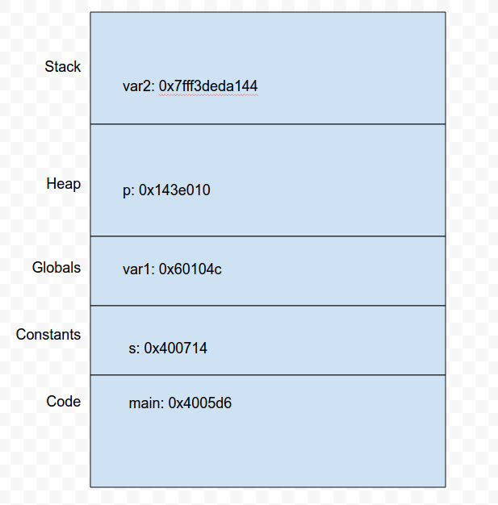

# Exercise 2

### The address space

1. Compile and run `aspace.c` in this directory.

2. Read the code.  You might want to [read about malloc here](https://www.tutorialspoint.com/c_standard_library/c_function_malloc.htm).

3. Based on the output, draw a sketch of the virtual address space (see page 80 of HFC).  Show the relative locations of the stack, heap, globals, constants, and code.

4. Add a second call to `malloc` and check whether the heap on your system grows up (toward larger addresses).  

It does.

5. Add a function that prints the address of a local variable, and check whether the stack grows down.  

It does.

6. Choose a random number between 1 and 32, and allocate two chunks with that size.  
How much space is there between them?  Hint: Google knows how to subtract hexadecimal numbers.

I malloc'd 18 bytes, and saw that they were 0x20 = 32 bytes apart.

### Stack allocated data

1.  Read `stack.c`, which should be in this directory.  What is it
intended to do?  What would the output be if the program worked as
expected?

This code has no comments so it's not easy to tell what it's trying to do. It seems like it's trying to make an array of 42s in one function and print them in main. Not sure what bar is supposed to do.

2.  Compile it.  Do you get a warning?  What does it mean?

I get a warning that `foo()` returns the address of a local variable, meaning the address won't be valid outside of that function.

3.  Run it.  What happens?  You might get a segmentation fault, or you might get
some strange output.  Can you explain it?  You might find it
helpful to draw a stack diagram.

Seg fault. The function `foo()` returns the address of a stack variable which is only scoped for that function itself. So when `main()` tries to print it, it's illegally accessing memory and gets a segmentation fault

4.  Comment out the `print` statements in `foo()` and `bar()` and run
it again.  What happens now?

When I uncomment the print statements in `foo()` and `bar()`, they both print the address `0x7fff8b1ccba0`. It seems that they both choose the same place (presumably the top of the stack) to allocate memory for the local memory.

5.  Add comments to the code to explain these experiments and the results,
then check the code in to the repo.

Moral: Don't return pointers to stack allocated data!

### Adder

Create a file named `adder.c` and write a program that allows the user to enter integers, one per line, until the user hits Control-D, which is the end-of-file (EOF) character.

It should convert the numbers from input strings to integers and store the integers in an array.  The program should produce appropriate error messages if the user enters something that exceeds the length of the input buffer, or can't be converted to an integer.  It should also produce an error message if the user enters more numbers than will fit in the array.

After the user enters Control-D, the program should add up the numbers in the array and print the result.  

Your program should be divided into at least two functions with well designed interfaces.

Optionally, the program should produce an error if the sum exceeds the largest integer that can be represented.

Hint: You will probably want to use two functions we haven't seen yet:

* strlen: [Read about it here](https://www.tutorialspoint.com/c_standard_library/c_function_strlen.htm)

* atoi: [Read about it here](https://www.tutorialspoint.com/c_standard_library/c_function_atoi.htm)

Before you use there functions, you need to `#include <string.h>`.
